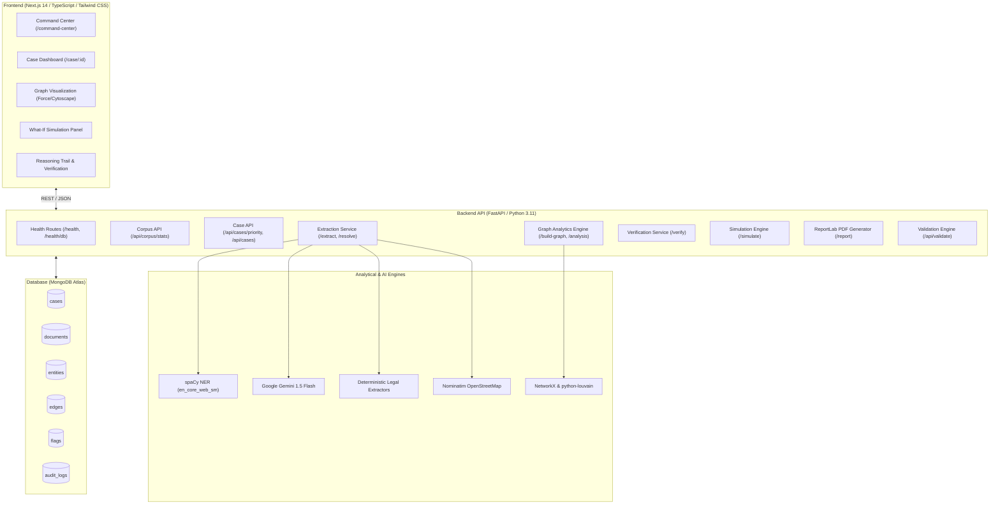

# NEXUS — AI-Powered Criminal Network Analysis System
**SIH26189GREEN** | Ministry of Home Affairs (Software / Blockchain & Cybersecurity)

[](https://nexus-frontend-qtak.onrender.com/)
[](https://nexus-backend-obb9.onrender.com/health)
[](https://python.org)
[](https://nextjs.org)
[](https://fastapi.tiangolo.com)
[](https://mongodb.com)

NEXUS is an intelligence-grade, explainable criminal network analysis and decision-support system designed for law enforcement agencies, state police crime branches, the Central Bureau of Investigation (CBI), the National Investigation Agency (NIA), and financial crime intelligence units.

NEXUS transforms unstructured, multi-document legal case files, charge sheets, FIRs, and court judgments into actionable entity-relationship knowledge graphs, automates syndicate hierarchy identification, uncovers complex illicit financing patterns (hawala, shell structuring, layering), and provides court-ready investigative dossiers with complete evidentiary provenance.

---

## Live Deployments

* **Frontend Application**: [https://nexus-frontend-qtak.onrender.com/](https://nexus-frontend-qtak.onrender.com/)
* **Backend API & Swagger**: [https://nexus-backend-obb9.onrender.com/docs](https://nexus-backend-obb9.onrender.com/docs)
* **Backend Health Check**: [https://nexus-backend-obb9.onrender.com/health](https://nexus-backend-obb9.onrender.com/health)
* **Database Health Check**: [https://nexus-backend-obb9.onrender.com/health/db](https://nexus-backend-obb9.onrender.com/health/db)

---

## What NEXUS Does

NEXUS processes raw legal and investigative narratives through an end-to-end analytical pipeline:

```text
┌─────────────────────────────────┐
│ Documents / Legal Judgments     │ Indian Kanoon judgments, FIRs, charge sheets, depositions
└────────────────┬────────────────┘
                 │
                 ▼
┌─────────────────────────────────┐
│ Entity & Relationship Extraction│ Hybrid: spaCy NER + Gemini 1.5 + deterministic legal regex
└────────────────┬────────────────┘
                 │
                 ▼
┌─────────────────────────────────┐
│ Entity Resolution               │ RapidFuzz phonetic & token matching across aliases & roles
└────────────────┬────────────────┘
                 │
                 ▼
┌─────────────────────────────────┐
│ Graph Construction              │ Directed multi-relational NetworkX graph stored in MongoDB
└────────────────┬────────────────┘
                 │
                 ▼
┌─────────────────────────────────┐
│ Centrality & Community Detection│ Degree, Betweenness, Eigenvector & Louvain modularity
└────────────────┬────────────────┘
                 │
                 ▼
┌─────────────────────────────────┐
│ Reasoning Trail & Explainability│ Deterministic rule-based step-by-step audit trail
└────────────────┬────────────────┘
                 │
                 ▼
┌─────────────────────────────────┐
│ Verification & Human-in-the-Loop│ Interactive analyst confirmation / rejection with audit log
└────────────────┬────────────────┘
                 │
                 ▼
┌─────────────────────────────────┐
│ What-If Simulation              │ Subgraph isolation & network disruption impact analysis
└────────────────┬────────────────┘
                 │
                 ▼
┌─────────────────────────────────┐
│ Investigative Dossier Export    │ Court-ready PDF dossier with exact evidentiary provenance
└─────────────────────────────────┘
```

---

## Key Features

### 1. Corpus-Level Command Center
* **Corpus Operations**: Provides a unified overview across all 20+ ingested cases and 7,800+ entities, breaking open investigative silos.
* **Case Priority Queue**: Categorizes cases into operational statuses (`Ready`, `Needs Analysis`, `Needs Verification`, `Insufficient Data`) based on factual graph and flag metrics.
* **Real-Time Corpus Metrics**: Aggregates document counts, verified entities, relationships, pattern flags, and ground-truth validation scores directly from MongoDB aggregations.

### 2. Hybrid Entity & Relationship Extraction
* **Multi-Engine Extraction**: Combines spaCy (`en_core_web_sm`) for grammatical named-entity recognition with deterministic legal regular expressions (FIR numbers, IPC / NDPS / PMLA legal sections, monetary sums, phone numbers, vehicle registrations).
* **LLM Fallback**: Google Gemini 1.5 Flash structured entity and relation extraction with instant, seamless fallback to deterministic regex and spaCy if LLM services are offline or rate-limited.
* **Strict Evidence Grounding**: Character-exact offset preservation (`start_char`, `end_char`) and 120-character contextual snippet capture. Zero hallucinated links.

### 3. Entity Resolution & Alias Merging
* **Fuzzy De-Duplication**: RapidFuzz-based token sort and Levenshtein similarity algorithms merge variants (e.g., *"Dawood Ibrahim Kaskar"*, *"D-Company Kingpin"*, *"Dawood Ibrahim"*).
* **Cross-Document Entity Linking**: Resolves entities appearing across multiple case judgments into canonical network identities.

### 4. Graph Analytics & Criminal Network Metrics
* **Centrality Ranking**: Computes Degree Centrality (operational activity), Betweenness Centrality (information brokers / financial conduits), and Eigenvector Centrality (proximity to syndicate leadership).
* **Community Detection**: Fast Louvain modularity clustering uncovers distinct criminal cells, operational wings, logistics units, and front organizations.
* **Interactive Visualization**: Canvas-based Force Graph and Cytoscape visualization with zoom, pan, node search, and community color-coding.

### 5. Pattern Detection & Syndicate Typologies
* **Hawala Networks**: Circular cash routing without physical cross-border transit.
* **Shell Companies & Layering**: Rapid round-tripping of funds across paper companies.
* **Hub-and-Spoke Syndicates**: Central kingpin coordinating isolated co-conspirators.
* **Smuggling & Narcotics Conduits**: Cross-district contraband trafficking routes.

### 6. Explainable AI (Reasoning Trail)
* **Deterministic Explainability**: Generates plain-language investigative reasoning steps explaining *why* an individual is ranked as a syndicate leader or *why* a transaction cluster was flagged.
* **Statutory Citations**: Links pattern flags directly to relevant legal provisions (e.g., PMLA Section 3/4, IPC Section 120B, NDPS Section 29).

### 7. Interactive Human-in-the-Loop Verification
* **Analyst Override**: Investigators can confirm, modify, or reject any extracted entity, relationship, or pattern flag.
* **Audit Trail**: Every verification decision is recorded with timestamps, analyst notes, and original evidence references for chain-of-custody compliance.

### 8. What-If Network Disruption Simulation
* **Arrest & Interdiction Modeling**: Simulate the arrest of key kingpins or seizure of bank accounts.
* **Network Impact Metrics**: Instantly recomputes graph fragmentation, remaining bridge nodes, and disconnected components.
* **State Restoration**: One-click rollback restores the baseline graph without database pollution.

### 9. Synthetic Data Generator
* **Investigative Prototyping**: Generates realistic Call Detail Records (CDRs) and financial transaction logs (IMPS, RTGS, NEFT, Hawala slips) using Faker.
* **Case Fusion**: Synthesized records seamlessly attach to existing entities to stress-test financial conspiracy detection algorithms.

### 10. Court-Ready Dossier Export
* **ReportLab PDF Engine**: Generates comprehensive PDF investigative briefs including executive summaries, network metrics, community breakdown tables, pattern flag registers, and full evidentiary citations.

---

## Command Center

The NEXUS **Command Center** (`/command-center`) provides an intelligence operational headquarters across the entire repository of cases:

```
┌────────────────────────────────────────────────────────────────────────┐
│ NEXUS COMMAND CENTER                                                  │
│ Corpus-wide intelligence and case operations                           │
├─────────────┬─────────────┬─────────────┬─────────────┬────────────────┤
│ Documents   │ Cases       │ Entities    │ Edges       │ Flags          │
│ 20          │ 20          │ 7,821       │ 1,094       │ 14             │
├─────────────┴─────────────┴─────────────┴─────────────┴────────────────┤
│ CASE PRIORITY QUEUE                                                    │
│ Case Title                    | Entities | Edges | Flags | Status      │
│ State vs Suresh Verma & Ors   | 225      | 198   | 2     | Needs Verify│
│ Narcotics Syndicate FIR 88/21 | 142      | 112   | 4     | Ready       │
│ Hawala Matrix R-402           | 89       | 74    | 3     | Needs Verify│
└────────────────────────────────────────────────────────────────────────┘
```

* **Why it exists**: Criminal syndicates do not operate inside a single court judgment. The Command Center allows supervisors to identify multi-case connections and triage team priorities.
* **Priority Queue Logic**: 
  - `Ready`: Case is analyzed and verified by analysts.
  - `Needs Analysis`: Case ingested but graph/centrality pipeline has not yet executed.
  - `Needs Verification`: Case analyzed; contains unverified flags or high-centrality suspect nodes.
  - `Insufficient Data`: Case contains fewer than 2 entities or insufficient evidence for graph construction.

---

## Architecture



---

## Tech Stack

| Category | Technology | Usage in NEXUS |
| :--- | :--- | :--- |
| **Frontend Framework** | Next.js 14 (App Router) | High-performance React server and client components |
| **Styling & Icons** | Tailwind CSS, Lucide React | Clean, high-contrast law enforcement design system |
| **Visualization** | Canvas Force Graph / Cytoscape | Interactive multi-cluster criminal network exploration |
| **Backend Framework** | FastAPI (ASGI / Uvicorn) | High-throughput asynchronous REST API |
| **Database** | MongoDB Atlas / PyMongo / Motor | Document storage for cases, graph nodes, edges, and provenance |
| **NLP & NER** | spaCy (`en_core_web_sm`) | Grammatical entity recognition (PERSON, ORG, GPE) |
| **Generative AI** | Google Gemini 1.5 Flash | Complex multi-relation legal document parsing (with local fallback) |
| **Graph Analytics** | NetworkX, python-louvain | Centrality calculations and Louvain community clustering |
| **Fuzzy Matching** | RapidFuzz | High-speed Levenshtein & token sort alias resolution |
| **Geospatial** | Nominatim (OpenStreetMap) | Location resolution and coordinates enrichment |
| **Dossier Synthesis**| ReportLab | Automated legal-grade PDF brief generation |
| **Testing** | pytest, httpx, TestClient | Automated pipeline, unit, and failure simulation tests |
| **Deployment** | Render Web Services | Cloud deployment with automated CI/CD from `main` |

---

## Data & Provenance

NEXUS guarantees evidentiary integrity through strict character-level provenance:

* **Corpus Ingestion**: Real criminal judgments curated from the Indian Kanoon legal repository, spanning Indian Penal Code (IPC), NDPS Act, and Prevention of Money Laundering Act (PMLA) cases.
* **Character-Level Grounding**: Every extracted entity and relationship retains:
  - `start_char` and `end_char`: Exact string indices in source text.
  - `source_reference`: Document identifier and court judgment citation.
  - `evidence_snippet`: Verbatim 120-character textual context surrounding the entity.
* **Zero Hallucination Policy**: If the LLM produces a relation that cannot be grounded in source text, deterministic validation rejects it.
* **Zero Missing Provenance**: The automated database integrity verification query verifies that 100% of stored entities and edges contain valid provenance:
  ```text
  Missing entity provenance: 0
  Missing edge provenance:   0
  TOTAL INVALID PROVENANCE: 0
  ```

---

## Ground-Truth Validation

NEXUS was empirically benchmarked against the documented **Noordin Top Terrorist Network** covert dataset (`/api/validate`):

* **Dataset**: 1-mode multi-relational covert network documenting 19 core conspirators.
* **Empirical Results**:
  - **Identified Figures**: NEXUS identified **4 out of the top 5** key covert network figures (**80% top-k recall**):
    - *Noordin Top* (Kingpin / Strategic Director) — Centrality Rank #1
    - *Azahari Husin* (Bomb Maker / Logistics Chief) — Centrality Rank #2
    - *Umar Patek* (Operational Commander) — Centrality Rank #3
    - *Dulmatin* (Communications Specialist) — Centrality Rank #4
  - **Community Alignment**: Louvain clustering cleanly segmented the network into operational strike units, logistics cells, and media/propaganda wings.
* **Documented Limitations**: Real-world covert networks suffer from incomplete surveillance records. NEXUS flags uncertain relationships with lower confidence scores rather than guessing connections.

---

## Security & Failure Resilience

NEXUS implements the **Task 8.1 Zero-Crash Rule (P0)**:

1. **LLM Service Outage / Rate Limit**: If Google Gemini is unavailable or rate-limited, the system falls back seamlessly to deterministic legal regexes and spaCy NER. Ingestion and analysis never crash.
2. **Database Connectivity Loss**: If MongoDB becomes temporarily unreachable, endpoints return clean HTTP 500 status codes with user-friendly diagnostics; no data is corrupted.
3. **Geocoding Timeout**: If the Nominatim API times out or fails, location entities are marked with `geocoding_status: unknown` while graph construction continues without delay.
4. **CORS Hardening**: Strict origin allowlist (`https://nexus-frontend-qtak.onrender.com` and `http://localhost:3000`). Wildcard (`*`) origins are prohibited in production.
5. **Zero Secret Leaks**: All credentials (`MONGODB_URI`, `GEMINI_API_KEY`) are managed strictly through environment variables and never exposed to client applications or committed to source control.

---

## Local Development Setup

### Prerequisites
* **Python**: 3.11+ (Python 3.11 or 3.12 recommended)
* **Node.js**: 18+ (Node 20 LTS recommended)
* **MongoDB**: Local MongoDB instance (`mongodb://localhost:27017`) or free MongoDB Atlas URI.

### 1. Clone the Repository
```bash
git clone https://github.com/brijeshearn12-dotcom/NEXUS.git
cd NEXUS
```

### 2. Backend Setup
```bash
cd backend

# Create and activate virtual environment
python -m venv .venv
# Windows:
.\.venv\Scripts\activate
# Linux/macOS:
source .venv/bin/activate

# Install dependencies and download spaCy model
pip install -r requirements.txt
python -m spacy download en_core_web_sm

# Configure environment variables
cp .env.example .env
# Edit .env with your MONGODB_URI

# Start the FastAPI server
uvicorn app.main:app --reload --port 8000
```
Backend API will be available at `http://localhost:8000`.

### 3. Frontend Setup
```bash
cd ../frontend

# Install dependencies
npm install

# Configure environment variables
cp .env.example .env.local
# Ensure NEXT_PUBLIC_API_URL=http://localhost:8000

# Start Next.js development server
npm run dev
```
Frontend will be available at `http://localhost:3000`.

---

## Environment Variables

### Backend Configuration (`backend/.env`)

| Variable | Required | Default | Description |
| :--- | :---: | :--- | :--- |
| `MONGODB_URI` | **Yes** | `mongodb://localhost:27017` | MongoDB connection string |
| `DB_NAME` | No | `nexus_db` | Primary database name |
| `CORS_ORIGINS` | No | `http://localhost:3000,http://127.0.0.1:3000` | Comma-separated allowed origins |
| `GEMINI_API_KEY` | No | `""` | Google Gemini API key (enables hybrid LLM extraction) |
| `INDIAN_KANOON_API_TOKEN` | No | `""` | Indian Kanoon API token for live judgment fetching |

### Frontend Configuration (`frontend/.env.local`)

| Variable | Required | Default | Description |
| :--- | :---: | :--- | :--- |
| `NEXT_PUBLIC_API_URL` | **Yes** | `http://localhost:8000` | Backend API base URL |

---

## Key API Endpoints

| Method | Endpoint | Description |
| :--- | :--- | :--- |
| `GET` | `/health` | Safe backend service liveness check |
| `GET` | `/health/db` | Safe database connection health check |
| `GET` | `/api/corpus/stats` | Aggregated corpus metrics (docs, cases, entities, edges, flags) |
| `GET` | `/api/cases/priority` | Case priority queue with triage statuses |
| `GET` | `/api/cases` | List all ingested cases |
| `POST` | `/api/cases/{case_id}/ingest` | Ingest case text narrative or charge sheet |
| `POST` | `/api/cases/{case_id}/extract` | Run hybrid entity and relationship extraction |
| `POST` | `/api/cases/{case_id}/resolve` | Run fuzzy entity resolution and alias merging |
| `POST` | `/api/cases/{case_id}/build-graph`| Construct NetworkX graph from verified entities |
| `GET` | `/api/cases/{case_id}/graph` | Retrieve nodes, edges, and clusters for visualization |
| `GET` | `/api/cases/{case_id}/analysis` | Compute centrality scores, communities, and reasoning trail |
| `POST` | `/api/cases/{case_id}/verify` | Submit analyst verification decisions with audit logging |
| `POST` | `/api/cases/{case_id}/simulate` | Run What-If node/edge removal simulation |
| `POST` | `/api/cases/{case_id}/synthetic` | Generate synthetic CDRs or transaction ledgers |
| `GET` | `/api/cases/{case_id}/report` | Download court-ready PDF investigative dossier |
| `GET` | `/api/validate` | Benchmark results against Noordin Top ground truth |

---

## Testing & Verification

NEXUS includes comprehensive test suites covering unit tests, full case pipelines, boundary conditions, failure simulations, and database provenance integrity:

### Run Local Test Suite
```bash
# Run backend unit and integration tests
pytest backend/tests

# Run Task 8.1 Comprehensive Verification Runner
python scripts/run_task81_verification.py

# Verify MongoDB Provenance Integrity
python scripts/verify_provenance_integrity.py

# Run Safe Production Smoke Test (against Render or localhost)
python scripts/production_smoke_test.py
```

### What the Test Suite Verifies:
* **Pipeline Integrity**: End-to-end processing across multiple legal cases.
* **Boundary Inputs**: Rejection of empty strings, graceful handling of very short orders, single-accused cases (no false conspiracies), and multi-accused syndicates.
* **Failure Resilience**: Mocked LLM outages, database timeouts, geocoding failures, and network timeouts. Zero crashes.
* **Evidentiary Provenance**: Strict database query ensuring zero ungrounded entities or relationships.

---

## Project Structure

```text
NEXUS/
├── backend/
│   ├── app/
│   │   ├── api/             # FastAPI routers (corpus, cases, validation, health)
│   │   ├── core/            # Configuration, MongoDB connection, logging
│   │   ├── models/          # Pydantic schemas (case, entity, edge, graph, flags)
│   │   └── services/
│   │       ├── extraction/  # Hybrid spaCy, Gemini, and regex extractors
│   │       ├── graph/       # NetworkX centrality, Louvain clustering, resolution
│   │       ├── analysis/    # Pattern detection (hawala, shell, hub-and-spoke)
│   │       ├── report/      # ReportLab PDF dossier generation
│   │       ├── synthetic/   # Faker-driven CDR & transaction generator
│   │       └── geocoding/   # Nominatim location resolver
│   ├── tests/               # Pytest automated test suites
│   ├── requirements.txt     # Python production dependencies
│   └── uvicorn_start.py     # Local runner
├── frontend/
│   ├── src/
│   │   ├── app/             # Next.js App Router (command-center, case dashboard)
│   │   ├── components/      # UI components (graph, reasoning trail, stat cards)
│   │   └── lib/             # API client, types, utility helpers
│   ├── package.json         # Node.js dependencies
│   └── tailwind.config.js   # Law enforcement theme configuration
├── data/
│   ├── curated/             # Curated Kanoon case judgments with metadata
│   └── validation/          # Ground-truth covert network benchmark datasets
├── scripts/
│   ├── production_smoke_test.py      # Non-destructive Render production verification
│   ├── run_task81_verification.py   # Full pipeline & failure resilience test runner
│   ├── verify_provenance_integrity.py# Automated MongoDB provenance query
│   └── fetch_corpus.py              # Kanoon API fetcher
├── render.yaml              # Render Blueprint deployment configuration
└── README.md                # Comprehensive documentation
```

---

## 9-Step Evaluation Walkthrough

Follow these steps to evaluate NEXUS live on Render:

1. **Open the Command Center**: Navigate to [https://nexus-frontend-qtak.onrender.com/command-center](https://nexus-frontend-qtak.onrender.com/command-center).
2. **Review Corpus Statistics**: View real aggregated metrics: 20 cases, 7,800+ entities, 1,000+ relationships, and the 4/5 ground-truth validation score.
3. **Inspect the Case Priority Queue**: Notice cases organized by investigative readiness (`Ready`, `Needs Verification`). Click on any case to enter its dashboard.
4. **Run Entity & Relationship Extraction**: View the extracted accused individuals, organizations, weapons, locations, and monetary values. Click any entity to inspect its character-level source snippet.
5. **Explore the Network Graph**: Pan, zoom, and inspect nodes. Notice how Louvain clustering groups co-conspirators into color-coded syndicates.
6. **Examine the Reasoning Trail**: Open the Explainability panel to see step-by-step logic detailing *why* specific suspects hold high betweenness centrality (brokers).
7. **Perform Human-in-the-Loop Verification**: Confirm or modify an entity. Observe the real-time update in the audit trail.
8. **Test What-If Simulation**: Remove a key hub suspect to simulate an arrest. Observe the instant graph rewiring and network fragmentation metrics. Click *Exit Simulation* to restore baseline data.
9. **Export Court-Ready Dossier**: Click *Download PDF Report* to generate and inspect the ReportLab-synthesized investigative brief.

---

## Limitations & Future Roadmap

* **Scanned Document OCR**: Current pipeline ingests text-based court judgments and digital FIRs. Integrating Tesseract / Surya OCR will expand support to degraded physical police diaries.
* **LLM Quota Management**: When processing massive hundreds-of-page trial records, cloud LLM token windows are optimized via chunking. Future work includes hosting open-weight fine-tuned local SLMs (e.g., Llama 3 8B) for air-gapped police networks.
* **Scale-Out Graph Partitioning**: Current NetworkX engine comfortably handles thousands of nodes in memory. For nation-wide databases with millions of entities, graph processing will migrate to Neo4j / Apache AGE.
* **Real-Time Telecom Feeds**: Adding streaming Kafka connectors for real-time live wiretap and tower-dump CDR ingestion.

---

## License

Distributed under the **MIT License**. Created for the **Smart India Hackathon (SIH 2024)** | Problem Statement: **SIH26189GREEN** | Ministry of Home Affairs.
