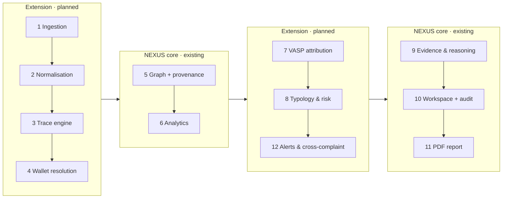

# NEXUS

### Evidence-Traceable Blockchain Investigation Intelligence

**Smart India Hackathon 2026 · SIH26183 · Team VERONICA (Team ID 183121)**

> **Problem Statement SIH26183** — *Real-Time Identification of Fraud-Linked Cryptocurrency Exchanges from
> Victim-Reported Suspect Wallet Addresses through Automated Blockchain Analytics*
> Ministry of Home Affairs · Indian Cyber Crime Coordination Centre (I4C) · Blockchain & Cybersecurity · Software

> [!IMPORTANT]
> **Project status.** The **NEXUS core engine** (evidence-linked graph, NetworkX analytics, reasoning trail,
> investigator confirm/reject, audit trail, PDF reports) is a **working prototype** in this repository.
> The **blockchain layer for SIH26183** (wallet intake, chain adapters, tracing, clustering, VASP attribution,
> typology and risk engines, alerts) is **designed and planned — not implemented yet**. Every capability below is
> labelled accordingly. No accuracy figures, live integrations or real-case results are claimed.

---

## The problem

Cyber-fraud victims (investment and task scams, sextortion, ransomware, phishing) increasingly report the
**cryptocurrency wallet addresses** that received their money. Those wallets are often burner, non-custodial or
intermediary wallets used for layering. To freeze assets and recover funds, investigators need to know **which
exchange / VASP the money reached** — but tracing it by hand means following many hops across block explorers,
multiple chains, mixers and bridges. That takes expertise and time, and delays freezing requests to VASPs.

## The solution

NEXUS turns a victim-reported suspect wallet into an **evidence-backed VASP / exchange lead**: it traces the funds,
explains every hop, and leaves the decision to the investigator.

```text
VICTIM-REPORTED WALLET → multi-chain ingestion → normalisation → multi-hop trace
  → wallet / entity resolution → transaction graph → clustering & pattern detection
  → VASP / EXCHANGE ATTRIBUTION → risk intelligence → evidence + explanation
  → INVESTIGATOR VERIFICATION → auditable investigation report
```

**Principle — Evidence before attribution.** NEXUS proposes; the investigator verifies. A wallet is never labelled
criminal because of an automated score, and **one signal never creates an attribution**: a *potential VASP lead*
needs multiple corroborating signals plus traceable evidence (transaction hash, amount, time, hop, path).

---

## Key capabilities

| Capability | What it does | Status |
|---|---|---|
| Evidence provenance | Source, method, confidence and timestamp on every node and edge | **Existing core** |
| Graph analytics | Degree, betweenness, PageRank, Louvain communities, bridge (articulation) nodes | **Existing core** |
| Reasoning trail | Plain-language explanation of every ranking and flag | **Existing core** |
| What-if analysis | Remove a node, recompute the graph and rankings, restore | **Existing core** |
| Investigator verification | Confirm / reject findings; decisions persisted | **Existing core** |
| Audit trail | Append-only log of analyst decisions (not cryptographically tamper-evident) | **Existing core** |
| Investigation report | PDF report generation (ReportLab) | **Existing core** |
| Cross-case correlation | Corroboration-gated candidate links across cases (feature-flagged) | **Existing core** |
| Wallet intelligence | Wallet profile, inflow/outflow, counterparties, timeline | Planned |
| Multi-chain adapters | Bitcoin (UTXO), Ethereum / EVM, TRON → one common transaction schema | Planned |
| Multi-hop tracing | Hop depth, time window, value threshold, direction, path reconstruction | Planned |
| Wallet clustering | Chain-specific heuristics (UTXO common-input / change; account-model deposit patterns) | Planned |
| Wallet role classification | Suspect, intermediary, deposit, hot, exchange, mixer, bridge — each with signals | Planned |
| VASP / exchange attribution | Multi-signal *potential VASP lead* with High / Medium / Low confidence | Planned |
| Fraud / laundering typologies | Layering, fan-in/out, peel chains, rapid movement, mixer/bridge, cross-chain | Planned |
| Explainable risk | Risk factors → severity → investigation priority (framework, not a validated score) | Planned |
| Alerts & cross-complaint intelligence | Trace-on-intake alerts; wallets / infrastructure shared across complaints | Planned |
| ML-assisted typologies | Only after labelled / synthetic data and features exist | Planned (later phase) |
| NCRP / SAHYOG integration | Only with official access | Planned (subject to access) |

Full mapping to the problem statement: [`docs/sih26183-alignment.md`](docs/sih26183-alignment.md).

---

## Architecture


```mermaid
flowchart LR
    subgraph E1["Extension · planned"]
        direction TB
        IN["1 Ingestion"] --> NO["2 Normalisation"] --> TR["3 Trace engine"] --> WR["4 Wallet resolution"]
    end
    subgraph C1["NEXUS core · existing"]
        direction TB
        GE["5 Graph + provenance"] --> AN["6 Analytics"]
    end
    subgraph E2["Extension · planned"]
        direction TB
        VA["7 VASP attribution"] --> TY["8 Typology & risk"] --> AL["12 Alerts & cross-complaint"]
    end
    subgraph C2["NEXUS core · existing"]
        direction TB
        EV["9 Evidence & reasoning"] --> WS["10 Workspace + audit"] --> RP["11 PDF report"]
    end
    E1 --> C1 --> E2 --> C2
```

Details, data model and module map: [`docs/architecture.md`](docs/architecture.md) ·
methods: [`docs/methodology.md`](docs/methodology.md) · planned API: [`docs/api-design.md`](docs/api-design.md).

---

## Technology stack

| Layer | In use today | Planned for SIH26183 |
|---|---|---|
| Backend | Python, FastAPI, Pydantic | Chain adapters, trace / attribution / typology / risk services |
| Graph & analytics | NetworkX (centrality, Louvain, articulation points) | Path reconstruction, clustering heuristics |
| Storage | MongoDB (PyMongo) | Transfer, wallet, label, lead and alert collections |
| Frontend | Next.js 14, React, Tailwind CSS, Cytoscape.js | Wallet page, trace-path view, VASP lead review, alerts |
| Reports | ReportLab | Blockchain investigation report sections |
| Chain data | — | Node / explorer APIs (candidates: Esplora, Etherscan, TronGrid) — only where access is permitted |
| ML | — (no trained model) | Rule-based first; ML-assisted typology detection only after labelled data exists |

---

## Current status

### Working prototype (NEXUS core)

Implemented and tested in this repository on the prototype's original dataset (see *Origin* below):
graph construction with provenance, centrality and community analytics, pattern flags with reasoning trails,
what-if simulation, investigator confirm / reject, audit trail, PDF report generation, a case priority queue,
corroboration-gated cross-case matching (off unless `ENABLE_CROSS_CASE=true`), and rule-based operation with no
LLM dependency. Engine documentation, setup and endpoints: [`docs/prototype-engine.md`](docs/prototype-engine.md).

### SIH26183 build roadmap

| Phase | Focus | Status |
|---|---|---|
| 0 | Submission package (deck, repository, docs) | **In progress** |
| 1 | Blockchain foundation — common schema, wallet intake, adapters | Planned |
| 2 | Trace engine | Planned |
| 3 | Wallet intelligence — roles, clustering, labels | Planned |
| 4 | VASP attribution | Planned |
| 5 | Fraud / laundering typologies | Planned |
| 6 | Risk engine | Planned |
| 7 | ML-assisted intelligence | Planned (after data exists) |
| 8 | Investigator dashboard | Planned |
| 9 | Reporting | Planned |
| 10 | Cross-complaint intelligence | Planned |
| 11 | Real-time alerting | Planned |
| 12 | Integrations (NCRP, SAHYOG, chain APIs) | Planned (subject to access) |

Roadmap: [`docs/roadmap.md`](docs/roadmap.md) · MVP, demo scenario and task tracker:
[`docs/project-plan.md`](docs/project-plan.md).

---

## Demo

- **Blockchain demo:** not available yet. The planned demo follows one **synthetic** scenario — a victim-reported
  wallet traced over four hops to an exchange deposit address and hot-wallet cluster, producing a *potential VASP
  lead* with evidence, signals, confidence and risk: [`docs/project-plan.md#demo-scenario`](docs/project-plan.md#demo-scenario),
  data in [`data/synthetic/demo_scenario_v1.json`](data/synthetic/demo_scenario_v1.json). All values in it are
  synthetic.
- **Prototype engine:** can be run locally (offline, no API keys) — see
  [`docs/prototype-engine.md`](docs/prototype-engine.md#running-locally).

## Screenshots

TBD — blockchain views (wallet page, trace path, VASP lead review) will be added as they are built.

---

## Repository layout

```text
NEXUS/
├── README.md
├── docs/
│   ├── architecture.md          # SIH26183 architecture, data model, module map
│   ├── methodology.md           # tracing, clustering, attribution, typologies, risk, validation
│   ├── sih26183-alignment.md    # problem-statement requirement → NEXUS capability → status
│   ├── api-design.md            # planned endpoints and schemas (design only)
│   ├── roadmap.md               # phases 0–12
│   ├── project-plan.md          # MVP, demo scenario, task tracker, post-submission plan
│   ├── submission-checklist.md
│   ├── prototype-engine.md      # the existing NEXUS core: modules, endpoints, setup
│   └── task-*.md                # engineering logs from the prototype phase
├── backend/
│   ├── app/api/                 # FastAPI routers (existing)
│   ├── app/models/              # Pydantic models incl. Provenance (existing)
│   ├── app/services/            # graph, analytics, extraction, synthetic, reports (existing)
│   │   └── blockchain/          # SIH26183 layer — planned (README only)
│   └── tests/                   # pytest suites (existing)
├── frontend/                    # Next.js investigator UI (existing)
├── data/
│   ├── curated/                 # prototype's original corpus (existing)
│   ├── validation/              # prototype benchmark data (existing)
│   └── synthetic/               # SIH26183 synthetic demo scenario
├── scripts/                     # tooling: offline demo backend, smoke tests, capture (existing)
└── brain.md · design.md · memory.md   # internal development notes from the prototype phase
```

---

## Origin

NEXUS began as an evidence-traceable relationship-intelligence engine over Indian court judgments. That engine —
provenance-first graph, analytics, explanation, verification, audit and reporting — is what SIH26183 reuses. The
judgment-extraction pipeline and curated corpus remain in the repository as the prototype's original data source;
they are not part of the SIH26183 solution.

## Team

**Team VERONICA** · Team ID **183121** · Members: TBD

## License

TBD — no license file has been added to this repository yet.
