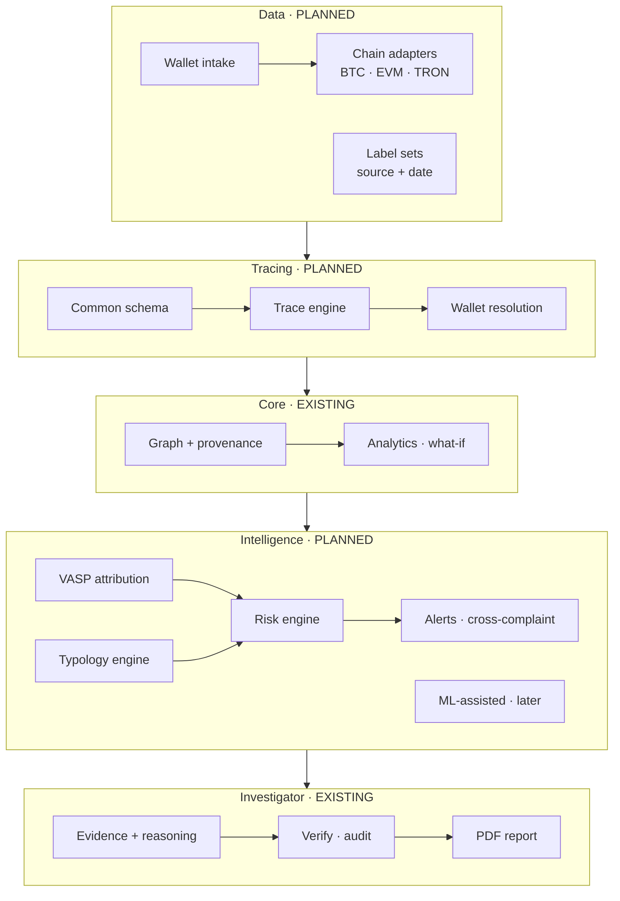
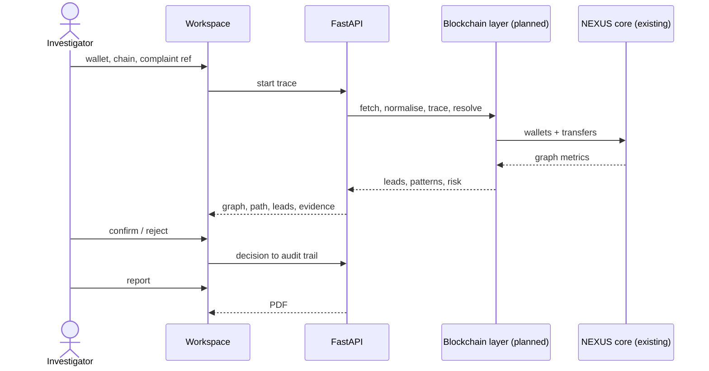

# NEXUS for SIH26183 — Architecture

**Status legend:** **EXISTING** = implemented in the NEXUS core today · **PLANNED** = SIH26183 extension, designed
but not built · **TBD** = open decision.

## 1. Design principles

1. **Evidence before attribution.** Every finding points back to transactions (hash, chain, time, amount, hop) and
   to the rule or signal that produced it. No finding exists without evidence.
2. **One signal ≠ attribution.** A *potential VASP lead* requires several corroborating signals; a single label hit
   or a single hop to a known address is never enough. (Same principle as the existing cross-case matcher, where a
   name alone never creates a proposal.)
3. **NEXUS proposes, the investigator verifies.** Leads, roles, clusters and risk are proposals with confidence;
   the investigator confirms or rejects, and the decision is logged.
4. **Chain-agnostic core.** Chain differences stay in adapters; everything after normalisation works on one common
   transaction schema.
5. **Rules first, ML later.** Deterministic, explainable rules ship first; ML-assisted typologies come only after
   labelled or synthetic data and features exist.
6. **No unverifiable claims.** Nothing is presented as integrated, real-time or accurate until tested and measured.

## 2. Layered view

## 3. Components

| # | Component | Responsibility | Status | Location |
|---|---|---|---|---|
| 1 | Data ingestion | Accept wallet + chain + complaint reference; validate address format per chain | PLANNED | `backend/app/services/blockchain/intake/` |
| 2 | Chain adapters | Fetch transactions for an address from a permitted source; one adapter per chain family | PLANNED | `backend/app/services/blockchain/adapters/` |
| 3 | Normalisation | Map UTXO and account-model data (incl. token transfers) to the common schema; common units; UTC | PLANNED | `backend/app/services/blockchain/normalise/` |
| 4 | Trace engine | Bounded multi-hop traversal; path reconstruction; stop / flag at mixers and bridges | PLANNED | `backend/app/services/blockchain/tracing/` |
| 5 | Wallet resolution | Chain-specific clustering; role classification; label matching | PLANNED | `backend/app/services/blockchain/resolution/` |
| 6 | Graph engine | Store wallets and transfers as nodes / edges with provenance; load into NetworkX | EXISTING (new node / edge types needed) | `backend/app/services/graph/` |
| 7 | Analytics | Centrality, communities, bridge / broker detection, what-if | EXISTING | `backend/app/services/analytics/` |
| 8 | VASP attribution | Combine signals into a potential VASP lead with confidence | PLANNED | `backend/app/services/blockchain/attribution/` |
| 9 | Typology engine | Rule-based laundering-pattern detection | PLANNED | `backend/app/services/blockchain/typology/` |
| 10 | Risk engine | Explainable risk factors → severity → priority | PLANNED | `backend/app/services/blockchain/risk/` |
| 11 | Evidence & explanation | Reasoning trail per lead, flag and ranking | EXISTING (extend to blockchain evidence) | `backend/app/services/analytics/key_individuals.py`, `pattern_flags.py` |
| 12 | Investigator workspace | Graph explorer, inspector, confirm / reject, audit | EXISTING (extend: wallet page, trace path, lead review) | `frontend/app/`, `backend/app/api/cases.py` |
| 13 | Reports | PDF investigation report | EXISTING (extend: blockchain sections) | `backend/app/services/report_generator.py` |
| 14 | Alerts & cross-complaint | Trace-on-intake alerts; shared wallets / infrastructure across complaints | PLANNED | `backend/app/services/blockchain/alerts/`; cross-complaint reuses `graph/cross_case_linker.py` |
| 15 | Integrations | NCRP / SAHYOG, chain data providers | PLANNED (subject to official access) | TBD |

The planned `blockchain/` package contains only a README until Phase 1 starts
([backend/app/services/blockchain/README.md](../backend/app/services/blockchain/README.md)).

## 4. Data model (planned)

The existing `Provenance` model (`backend/app/models/provenance.py`) is reused unchanged: `tier`, `source_ref`,
`method`, `confidence`, `extracted_at`, `metadata`. For blockchain data: `tier` = `primary` (chain data) /
`secondary` (third-party label) / `synthetic`; `source_ref` = transaction hash or label-source ID; `method` = `api`
or `derived`; `metadata` carries chain, block, hop and adapter details.

| Entity | Key fields |
|---|---|
| `Transfer` (common schema) | `chain`, `tx_hash`, `block_number`, `block_time` (UTC), `from_address`, `to_address`, `asset` (native / token contract), `amount_raw`, `amount` (decimal, asset units), `direction` relative to the traced wallet, `utxo_ref` (UTXO chains: input / output index), `adapter`, `fetched_at`, `provenance` |
| `Wallet` | `chain`, `address`, `first_seen`, `last_seen`, `tx_count`, `total_in`, `total_out`, `counterparties`, `labels[]` (label, category, source, as_of), `cluster_id`, `roles[]` (role, signals, confidence) |
| `Cluster` | `cluster_id`, `chain`, `members[]`, `heuristic` (e.g. common-input, deposit-sweep), `evidence[]`, `confidence` |
| `Trace` | `trace_id`, `case_id`, `seed_wallet`, `chain`, parameters (`max_hops`, `direction`, `window`, `min_value`), `paths[]`, `stats`, `created_at` |
| `Lead` | `lead_id`, `case_id`, `vasp` (label), `endpoint_wallet`, `path[]`, `signals[]` (type, evidence refs), `confidence` (high / medium / low), `risk` (level, factors[]), `status` (proposed / confirmed / rejected), `decided_by`, `decided_at`, `note` |
| `PatternFlag` | reuse existing flag model: `type` (fan-out, fan-in, peel-chain, rapid-movement, mixer, bridge, …), `nodes[]`, `evidence[]`, `reasoning_trail`, `verification_status` |
| `Alert` | `alert_id`, `type`, `case_id`, `wallet`, `trigger`, `evidence[]`, `created_at`, `acknowledged_by` |
| `Complaint` | `complaint_ref`, `reported_wallets[]`, `reported_at`, `case_id` — only with legitimate access to complaint data |

The schema definitions and endpoints are drafted in [api-design.md](api-design.md).

## 5. Request flow (MVP)

## 6. Deployment and operations (current → planned)

- **Current:** FastAPI + Next.js on Render, MongoDB Atlas, deployed from `main` (`render.yaml`). An offline demo
  backend runs the real API on an in-memory database (`scripts/offline_demo_backend.py`).
- **Planned:** cache adapter responses per `(chain, address, block range)`; bound every trace (hop / value / time)
  to keep API use and graph size predictable; access control before any real case data is handled (the prototype
  has no authentication).
