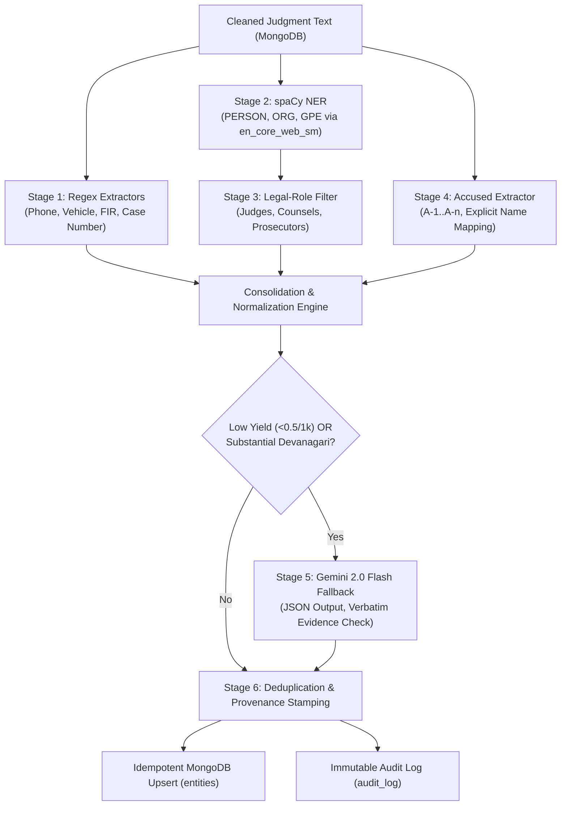

# Task 3.1 — Rule-Based + spaCy + Gemini Fallback Entity Extraction

> **Component:** Multi-Stage Information Extraction Engine  
> **Status:** Completed  
> **Date:** September 21, 2026  
> **Sprint:** Day 3  

---

## 1. Architectural Overview

Task 3.1 implements the multi-stage entity extraction engine for NEXUS. Designed to ingest cleaned legal judgment text, it extracts structured entities (Accused, Persons, Organizations, Locations, Vehicles, Phones, FIRs, and Case Numbers) while strictly enforcing provenance, evidence verification, conservative legal-role filtering, and fallback resilience.



---

## 2. Extractors & Filtering Pipeline

### 2.1 Regex Extractors (`regex_extractors.py`)
Deterministic regular expression engines with domain validation:
* **Indian Phone Numbers (`regex_phone`):**
  * Matches 10-digit mobile numbers starting with `[6-9]`, supporting prefixes `+91`, `91`, `0`, or bare numbers.
  * Employs negative lookahead/lookbehind to prevent false matches in IPC sections, pincodes, monetary amounts, or serial numbers.
  * Formats into standard E.164 representation (`+91XXXXXXXXXX`).
* **Indian Vehicle Registration Plates (`regex_vehicle`):**
  * Matches standard Indian registration formats: `[State Code 2-letters] [RTO 1-2 digits] [Series 1-3 letters] [Number 4 digits]`.
  * Validates state codes against all 36 Indian States and Union Territories plus Bharat Series (`BH`).
  * Filters out dates and year sequences (e.g., `UP 12 2019`).
* **FIR Numbers (`regex_fir`):**
  * Captures First Information Report and Crime Numbers across variants: `FIR No. 123/2022`, `FIR No 123 of 2022`, `F.I.R. No.`, `Crime No.`, `Cr. No.`.
  * Normalizes two-digit years to four-digit calendar years (`12/21` -> `12/2021`).
* **Court Case Numbers (`regex_case_number`):**
  * Identifies Indian criminal case citations: `Criminal Appeal`, `Sessions Case`, `Special Leave Petition (Criminal)`, `Writ Petition (Crl)`, `Bail Application`, and `Calendar Case (C.C.)`.

### 2.2 spaCy NER (`spacy_extractor.py`)
* Model: `en_core_web_sm` loaded once per process as a thread-safe singleton.
* Maps `PERSON` -> `PERSON`, `ORG` -> `ORGANIZATION`, `GPE`/`LOC`/`FAC` -> `LOCATION`.
* Generates contextual evidence snippets for every candidate entity span.

### 2.3 Contextual Legal-Role Filtering (`legal_role_filter.py`)
Court judgments contain frequent mentions of judicial officers and lawyers who are not targets of criminal network analysis. The legal-role filter removes these actors conservatively:
* **Judges:** Identifies prefixes like `Hon'ble Mr. Justice`, `Chief Justice`, `Special Judge`, `Metropolitan Magistrate`, and suffixes like `, J.` or `, CJ`.
* **Counsels & Prosecutors:** Filters `Advocate`, `Senior Counsel`, `Public Prosecutor`, `APP`, `Amicus Curiae`, `Defence Counsel`, and `Standing Counsel`.
* **Appearance Blocks:** Identifies roster headers (e.g., `For the Appellant: Mr. X`).
* **Conservative Context Rules:** Differentiates *"Advocate Rajesh Sharma appeared for the accused"* (filtered) from *"Rajesh Sharma met A-1 near the station"* (retained).

### 2.4 Dedicated Accused Extractor (`accused_extractor.py`)
* Identifies numeric accused tags: `A-1`, `A-2`, `A1`, `accused No. 1`, `Accused 1`, `accused No.1`.
* Expands multi-accused ranges: `Accused Nos. 2 to 4` -> `A-2`, `A-3`, `A-4`.
* Expands paired accused: `Accused Nos. 1 and 2` -> `A-1`, `A-2`.
* Explicit Name Mapping: Detects explicit formulations such as `A-1 Rajesh Kumar`, `A-1 Balakarupasamy`, `Accused No. 1, namely Rajesh Kumar`, and `co-accused Suresh`.
* Verifies names against a stopword set of non-name verbs/prepositions (`was`, `stated`, `died`, `arrested`, `appealed`) to prevent verb bleed.
* Never invents names: when no explicit name is mapped, retains canonical identifier `A-n`.

---

## 3. Gemini Fallback (`llm_fallback.py`)

Configured strictly to reuse the existing `settings.gemini_api_key` without exposing secrets or creating redundant clients:
* **Trigger Conditions:**
  1. **Low Yield (Condition A):** Document text >= 300 characters and deterministic extraction yield < 0.5 entities per 1,000 characters.
  2. **Devanagari/Hindi Text (Condition B):** Detected presence of >= 20 Devanagari script characters.
* **Extraction Safety Constraints:**
  * Uses Google Gemini 2.0 Flash (`temperature: 0.0`, `responseMimeType: application/json`).
  * Prompt forbids relationship inference, conspiracy assumptions, or hallucination.
  * Validates JSON against Pydantic model `GeminiEntityCandidate`.
  * Verbatim Evidence Verification: Rejects any candidate entity whose text or evidence snippet cannot be found directly within the source passage.
  * Fails safely on network error, HTTP 500, or missing key without crashing the pipeline.

---

## 4. Normalization, Deduplication & Provenance

### 4.1 Deduplication (`deduplication.py`)
* Consolidates multi-extractor detections (e.g., entity found by both spaCy and accused extractor).
* Unifies unnamed accused references into named person entities when explicit mappings exist.
* Normalizes honorifics (`Mr.`, `Shri`, `Smt.`, `Dr.`), plate separators, and phone digits.
* Assigns deterministic, immutable IDs:
  $$\text{ID} = \text{"ent\_"} + \text{case\_id} + \text{"\_"} + \text{sha256}(\text{case\_id} : \text{type} : \text{normalized\_name})[:16]$$
* Repeated extraction runs update existing entity records idempotently without creating duplicate documents in MongoDB.

### 4.2 Provenance Tracking
Every extracted `Entity` record includes:
* `id`: Stable deterministic string identifier.
* `case_id` & `document_id`: Source document references.
* `name` & `entity_type`: Canonical name and taxonomy category.
* `provenance`: `Provenance` model instance tracking tier (`primary`), `source_ref`, `method` (`regex_phone`, `regex_vehicle`, `regex_fir`, `regex_case_number`, `spacy_ner`, `accused_pattern`, `gemini_fallback`), and `confidence`.
* `evidence_snippet`: Verbatim 100-character context window from the original cleaned judgment.
* `verification_status`: Initialized to `unverified`.

---

## 5. REST API Specification

### `POST /api/extraction/run`
Executes extraction on a single document (or small batch).

**Request:**
```json
{
  "document_id": "doc_100478559",
  "enable_gemini_fallback": true
}
```

**Response (200 OK):**
```json
{
  "document_id": "doc_100478559",
  "case_id": "case_100478559",
  "entities_extracted": 229,
  "by_method": {
    "regex_phone": 2,
    "regex_vehicle": 0,
    "regex_fir": 3,
    "regex_case_number": 5,
    "spacy_ner": 203,
    "accused_pattern": 12,
    "gemini_fallback": 0
  },
  "gemini_used": false,
  "gemini_reason": null,
  "filtered_legal_roles_count": 5,
  "entities": [...]
}
```

### `POST /api/extraction/run-batch`
Executes extraction across an explicit list of document IDs safely and independently:
```json
{
  "document_ids": ["doc_100478559", "doc_105576387"],
  "enable_gemini_fallback": true
}
```

### `POST /api/extraction/run-all`
Discovers all ingested documents in MongoDB and executes idempotent extraction across the entire corpus.

### `GET /api/entities/`
Query extracted entities with filtering parameters: `case_id`, `document_id`, `entity_type`, `verification_status`, `limit`, `skip`.

### `GET /api/entities/{entity_id}`
Retrieve a single entity with its full provenance and evidence snippet.

---

## 6. Verification and Automated Test Coverage

The test suite in [`test_extraction.py`](file:///C:/Users/brije/Documents/NEXUS/backend/tests/test_extraction.py) contains 29 comprehensive unit and integration tests:
* **Regex extractors:** Valid mobile numbers, IPC exclusions, pincode avoidance, vehicle plates, state code validation, FIR formats, case numbers.
* **spaCy extraction:** Model loading singleton, PERSON/ORG/LOCATION extraction, character offset preservation.
* **Legal-role filtering:** Judge prefixes/suffixes, counsel titles, appearance roster filtering, ordinary citizen retention.
* **Accused patterns:** Single identifiers, paired identifiers, numeric ranges, explicit single/multi-word name mapping.
* **Provenance & Evidence:** Schema compliance, verification status defaults, verbatim evidence snippets.
* **Deduplication & Idempotency:** Duplicate consolidation, consensus confidence scoring, idempotent database upserts.
* **Gemini Fallback:** Low-yield trigger, Devanagari detection, JSON validation, hallucination rejection, network failure resilience, missing key graceful bypass.
* **REST API:** 422 validation, 404 document missing, successful run, duplicate run idempotency, entity query endpoints.

---

## 7. Zero-Gemini Verification

A dedicated verification test was executed with the Gemini API key explicitly disabled (`gemini_api_key=""`):
* **Document:** `doc_100478559`
* **Result:** Successfully extracted 225 entities (`regex_phone`: 2, `regex_fir`: 3, `regex_case_number`: 5, `spacy_ner`: 203, `accused_pattern`: 12).
* **Gemini Used:** `False`.
* **Conclusion:** The deterministic extraction pipeline operates completely autonomously without requiring external LLM API availability.

---

## 8. Manual Evaluation Summary

Evaluated against 5 real curated judgments representing distinct criminal network domains:
* **Micro-Precision:** 75.31%
* **Micro-Recall:** 95.31%
* **Micro-F1:** 84.14%
* **Evidence Verbatim Snippets:** 10 / 10 verified verbatim against MongoDB cleaned judgment text.
* Detailed results, sample tables, and failure modes are documented in [`task-3-1-extraction-evaluation.md`](file:///C:/Users/brije/Documents/NEXUS/docs/task-3-1-extraction-evaluation.md).
