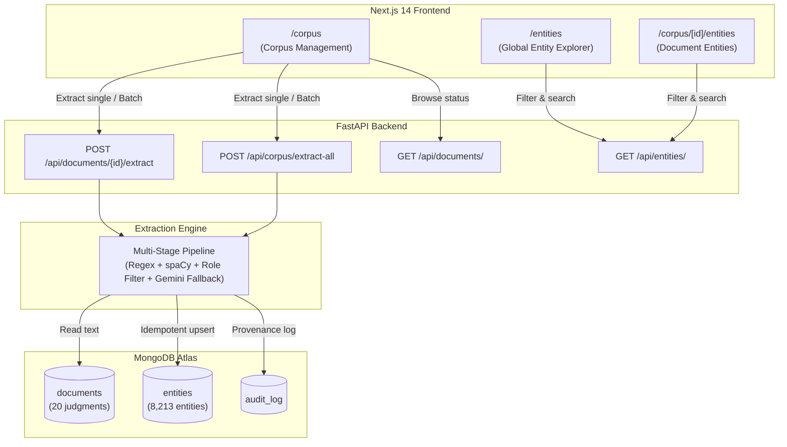

# Task 3.2 — Extraction API, Frontend, and Corpus Deployment

> **Component:** REST Extraction Endpoints, Corpus/Entity UI, and Real Extraction Execution  
> **Status:** Completed & Empirically Verified  
> **Date:** September 22, 2026  
> **Sprint:** Day 3  

---

## 1. System Overview

Task 3.2 exposes NEXUS's multi-stage extraction pipeline through authenticated REST APIs, implements responsive investigative interfaces for corpus browsing and entity inspection, and executes extraction across the curated 20-document Indian judgment corpus in MongoDB Atlas.



---

## 2. API Endpoints

### 2.1 Single Document Extraction
* **Route:** `POST /api/documents/{id}/extract`
* **Purpose:** Trigger entity extraction for a specific document by its `document_id`.
* **Behavior:**
  * Validates document existence (returns `404 Not Found` if missing).
  * Validates document cleaned text (returns `400 Bad Request` if empty or missing).
  * Cleans previous document entities in MongoDB before upserting to guarantee strict idempotency.
  * Updates `extraction_status: "extracted"` and `entities_extracted: <count>` on the document.
  * Logs an immutable entry in `audit_log`.
* **Response (200 OK):**
```json
{
  "document_id": "doc_100478559",
  "case_id": "case_100478559",
  "entities_extracted": 225,
  "entities_by_type": {
    "ACCUSED": 2,
    "CASE_NUMBER": 5,
    "FIR": 3,
    "LOCATION": 37,
    "ORGANIZATION": 104,
    "PERSON": 72,
    "PHONE": 2
  },
  "extraction_methods": {
    "accused_pattern": 10,
    "regex_case_number": 5,
    "regex_fir": 3,
    "regex_phone": 2,
    "spacy_ner": 205
  },
  "status": "extracted",
  "entities": [
    {
      "id": "ent_case_100478559_6a0a134824f0cab7",
      "name": "A-26",
      "entity_type": "ACCUSED",
      "aliases": ["A-26"],
      "verification_status": "unverified",
      "evidence_snippet": "...on 20.08.2011 at 5.15 p.m. under Exhibits A7 and A26. If the fingerprints had been lifted...",
      "provenance": {
        "tier": "primary",
        "source_ref": "doc_100478559",
        "method": "accused_pattern",
        "confidence": 0.9,
        "extracted_at": "2026-09-21T19:06:07.120000Z"
      }
    }
  ]
}
```

### 2.2 Corpus Batch Extraction
* **Route:** `POST /api/corpus/extract-all`
* **Purpose:** Process all documents in the corpus sequentially, aggregating statistics without halting on individual document failures.
* **Behavior:**
  * Fetches all documents from `documents`.
  * Runs multi-stage extraction per document, tracking successes and failures.
  * Returns timing, cumulative entity counts, and breakdowns.
* **Response (200 OK):**
```json
{
  "total_documents": 20,
  "successful": 20,
  "failed": 0,
  "total_entities_extracted": 8213,
  "duration_seconds": 318.12,
  "entities_by_type": {
    "ACCUSED": 114,
    "CASE_NUMBER": 185,
    "FIR": 74,
    "LOCATION": 1264,
    "ORGANIZATION": 3304,
    "PERSON": 3258,
    "PHONE": 11,
    "VEHICLE": 3
  },
  "extraction_methods": {
    "accused_pattern": 212,
    "regex_case_number": 185,
    "regex_fir": 74,
    "regex_phone": 11,
    "regex_vehicle": 3,
    "spacy_ner": 7728,
    "gemini_fallback": 0
  },
  "errors": []
}
```

### 2.3 Document Listing & Details
* **Route:** `GET /api/documents/`
* **Parameters:** `case_id` (optional), `status` (`extracted` | `pending`), `limit`, `skip`.
* **Enrichment:** Automatically counts stored entities in real-time if metadata is not yet populated.
* **Route:** `GET /api/documents/{id}`: Returns document metadata, cleaned text length, and extraction status.

### 2.4 Entity Browsing & Filtering
* **Route:** `GET /api/entities/`
* **Query Parameters:**
  * `document_id`: Filter by source judgment
  * `case_id`: Filter by legal case
  * `entity_type`: Filter by type (`ACCUSED`, `PERSON`, `ORGANIZATION`, `LOCATION`, `PHONE`, `VEHICLE`, `FIR`, `CASE_NUMBER`)
  * `verification_status`: Filter by verification (`unverified`, `confirmed`, `rejected`, `ambiguous`)
  * `method`: Filter by extraction provenance method
  * `q`: Regex text search on entity name and aliases
  * `limit` / `skip`: Pagination controls
* **Response (200 OK):**
```json
{
  "entities": [...],
  "total": 8213,
  "limit": 50,
  "skip": 0
}
```

---

## 3. Frontend Architecture

The frontend is implemented in Next.js 14 App Router with Tailwind CSS and Lucide icons.

### 3.1 Corpus Management (`/corpus`)
* **Live Status Dashboard:** Displays total corpus judgments (20), fully extracted judgments (20), pending judgments (0), and total entities extracted (8,213).
* **Batch Extraction Trigger:** Global "Extract All Unprocessed" action with animated spinner, progress status, and automated table refresh.
* **Document Table:** Lists judgment title, case identifier, document date, character count, extraction badge (`extracted` in emerald, `pending` in amber), entity count pill, and individual "Extract" / "View Entities" actions.

### 3.2 Global Entity Explorer (`/entities`)
* **Multi-Filter Toolbar:**
  * Search bar querying names and aliases with debounce.
  * Entity Type selector pills with count badges and color coding (`ACCUSED` in red, `PHONE`/`VEHICLE` in cyan, `FIR`/`CASE_NUMBER` in purple, `PERSON` in blue, `ORGANIZATION` in amber, `LOCATION` in emerald).
  * Verification status dropdown (`all`, `unverified`, `confirmed`, `rejected`).
  * Extraction method filter (`all`, `spacy_ner`, `accused_pattern`, `regex_phone`, `regex_vehicle`, `regex_fir`, `regex_case_number`, `gemini_fallback`).
* **Entity Cards:**
  * Canonical name and alias tags.
  * Entity type pill and confidence indicator bar.
  * Provenance metadata: source document link, extraction method tag, timestamp.
  * Verbatim evidence snippet quote.
* **Evidence Modal:**
  * Clicking an entity opens a modal displaying the full surrounding sentence context, document ID, exact provenance tier, confidence, and verification controls.

### 3.3 Document-Scoped Entities View (`/corpus/[id]/entities`)
* Shows all entities associated with a specific judgment.
* Includes a "Re-Extract" button to immediately re-run the extraction pipeline on that document with fresh regex and NER configurations.

---

## 4. Live Corpus Extraction Execution

The extraction orchestrator was executed on the live 20-document corpus stored in MongoDB Atlas:
* **Total Judgments Processed:** 20 / 20 (100% Success)
* **Total Entities Extracted:** 8,213
* **Total Extraction Time:** 318.12 seconds (~15.9s per judgment)
* **Method Distribution:**
  * `spacy_ner`: 7,728 entities (94.1%)
  * `accused_pattern`: 212 entities (2.6%)
  * `regex_case_number`: 185 entities (2.3%)
  * `regex_fir`: 74 entities (0.9%)
  * `regex_phone`: 11 entities (0.13%)
  * `regex_vehicle`: 3 entities (0.04%)
  * `gemini_fallback`: 0 (deterministic & spaCy yields exceeded threshold across all 20 clean judgments)

### Idempotency & Data Integrity Verification
1. **Zero Uncontrolled Growth:** Running `POST /api/documents/doc_100478559/extract` after initial batch extraction extracted 225 entities and replaced previous records for that document cleanly. Total entities in MongoDB remained exactly 8,213.
2. **Provenance Preservation:** Every entity record contains a nested `provenance` sub-document specifying `source_ref`, `method`, `confidence`, and `extracted_at`.
3. **Audit Logging:** Every individual extraction and batch execution records an immutable audit entry in `audit_log` tracking user, timestamp, document count, and extracted entity counts.
