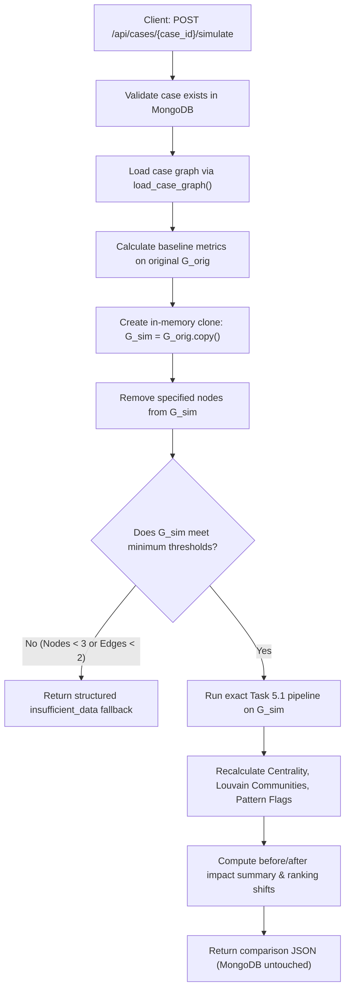

# Task 5.2 — Noordin Validation Harness & What-If Simulation

**SIH26189GREEN** | AI-Powered Criminal Network Analysis System  
**Track:** Ministry of Home Affairs — Software / Blockchain & Cybersecurity  

> [!IMPORTANT]
> **Legal Disclaimer:** Validation measures agreement with documented network figures; it does not establish legal guilt, responsibility, or intent.

---

## 1. Executive Summary

Task 5.2 validates the deterministic graph analytics pipeline developed in Task 5.1 against an internationally recognized, peer-reviewed covert dark network dataset (**Noordin Top Dark Network**), and deploys an in-memory **What-If Simulation** engine.

Strict methodological principles adhered to:
1. **Zero Algorithm Retuning:** The Task 5.1 analytics functions (`compute_centrality_metrics`, `compute_combined_rankings`, `detect_louvain_communities`, `rank_key_individuals`) were executed verbatim without altering weights, normalization schemes, or thresholds to artificially inflate scores.
2. **Documented Ground Truth:** Benchmark figures were drawn directly from academic literature and primary investigative reporting (Roberts & Everton 2011; ICG Asia Report No. 114; Everton 2012), not inferred post-hoc from algorithm outputs.
3. **True Unmodified Score:** The system reports the exact empirical score: **4 of top 5 match documented figures (80.0%)**.
4. **Non-Destructive Simulation:** What-if simulation operates entirely on an in-memory graph copy; the underlying MongoDB Atlas database and stored case graphs remain 100% immutable.

---

## 2. Noordin Top Dark Network Validation

### 2.1 Dataset Provenance & Literature Authority

* **Dataset Title:** Roberts and Everton Terrorist Data: Noordin Top Terrorist Network (Subset)
* **Compilers:** Professor Nancy Roberts, Professor Sean F. Everton, Daniel Cunningham (CORE Lab, Defense Analysis Department, Naval Postgraduate School, Monterey, CA)
* **Primary Source Document:** International Crisis Group (2006). *Terrorism in Indonesia: Noordin's Networks*. Asia Report N°114.
* **Academic Reference:** Everton, Sean F. (2012). *Disrupting Dark Networks*. Structural Analysis in the Social Sciences. Cambridge University Press.
* **Permanent DOI:** [10.17605/OSF.IO/ZMB9C](https://doi.org/10.17605/OSF.IO/ZMB9C)
* **Repositories:** Open Science Framework (OSF) & Association of Religion Data Archives (ARDA)

### 2.2 Relational Structure & Edge Files Used

The validation harness consumes the four standardized edge lists curated in Task 1.2 (`data/validation/`):

| Edge File | Count | Tie Definition | Confidence |
| :--- | :---: | :--- | :---: |
| `communication_edges.csv` | 6 | Bilateral communications, courier routes, phone calls | 1.0 |
| `operational_edges.csv` | 10 | Bomb fabrication, safehouse harborage, logistics | 1.0 |
| `trust_edges.csv` | 5 | Kinship ties (brothers, marriage) and madrasah trust | 1.0 |
| `financial_edges.csv` | 0 | Explicit pairwise transactions (intentionally 0 rows) | N/A |
| **Total Multi-relational Ties** | **21** | **19 unique undirected actor pairs across 19 actors** | **1.0** |

*Note on Financial Edges:* In strict compliance with the anti-fabrication directive, `financial_edges.csv` contains only headers (0 data rows). The primary Roberts & Everton matrices record relational trust, communication, and operational ties, but lack granular pairwise financial transaction logs.

### 2.3 Graph Construction & Normalization

The loader `build_noordin_graph()` in [`app/services/validation/noordin_loader.py`](file:///C:/Users/brije/Documents/NEXUS/backend/app/services/validation/noordin_loader.py) converts the raw edge lists into a standard NetworkX `Graph` identical in structure to NEXUS case graphs:
* **Node Schema:** `name`, `entity_type="PERSON"`, `verification_status="verified"`, `case_id="noordin_top"`, `evidence_snippet`
* **Edge Schema:** `weight`, `edge_type`, `relationship`, `evidence`, `case_ids=["noordin_top"]`, `document_ids=["icg_report_114"]`
* **Multi-tie Aggregation:** If multiple ties exist between two actors (e.g. Communication + Operational), weights accumulate deterministically (`round(existing_w + weight, 2)`) and edge types are tracked.

### 2.4 Documented Ground-Truth Figures

From `noordin_top_metadata.json` and ICG Asia Report No. 114:

| Documented Figure | Documented Role in Literature | Source Basis |
| :--- | :--- | :--- |
| **Noordin Mohammad Top** | Leader / Mastermind | Tanzim Qaidat al-Jihad strategist |
| **Azahari Husin** | Chief Bomb-maker | Technical bomb designer (Marriott/Bali) |
| **Irun Ali** | Logistics / Safehouse Harboring | Safehouse coordinator, kinship hub |
| **Urwah** | Operational Commander | Facilitator, weapons procurement |
| **Fathur Rahman al-Ghozi** | Paramilitary Trainer / Weapons | Senior operative, Mindanao trainer |

### 2.5 Identical Task 5.1 Analytics Pipeline Execution

The validation harness executes the exact Task 5.1 analytics:
* Degree Centrality ($C_D$)
* Betweenness Centrality ($C_B$)
* PageRank ($PR$, $\alpha=0.85$)
* Combined Deterministic Score:
  $$\text{score} = \text{round}(0.50 \cdot C_{D,\text{norm}} + 0.20 \cdot C_{B,\text{norm}} + 0.30 \cdot PR_{\text{norm}}, 4)$$
* Louvain Community Detection (deterministic seed=42)

### 2.6 Empirical Validation Results

#### Ranking Output on Noordin Top Network:

| Rank | Canonical Name | Combined Score | Degree | Raw Deg | Betweenness | PageRank | Ground Truth Match? |
| :---: | :--- | :---: | :---: | :---: | :---: | :---: | :---: |
| **1** | **Noordin Mohammad Top** | **1.0000** | 0.3889 | 7 | 0.8431 | 0.1839 | **YES (Leader / Mastermind)** |
| **2** | **Azahari Husin** | **0.5210** | 0.2222 | 4 | 0.4771 | 0.1093 | **YES (Chief Bomb-maker)** |
| **3** | **Urwah** | **0.3346** | 0.1667 | 3 | 0.2157 | 0.0878 | **YES (Operational Commander)** |
| **4** | **Irun Ali** | **0.2700** | 0.1667 | 3 | 0.1111 | 0.0669 | **YES (Logistics / Harboring)** |
| 5 | Anif Solchanudin | 0.1582 | 0.1111 | 2 | 0.1111 | 0.0520 | No (Ranked #5 in network) |
| 6 | Cholily | 0.1582 | 0.1111 | 2 | 0.1111 | 0.0520 | No (Courier) |
| 7 | Hasan | 0.1546 | 0.1111 | 2 | 0.1111 | 0.0501 | No (Harborer) |
| 8 | Subur Sugiarto | 0.1546 | 0.1111 | 2 | 0.1111 | 0.0501 | No (Expected centrality actor) |
| 9 | Zarkasih | 0.1546 | 0.1111 | 2 | 0.1111 | 0.0501 | No (Religious command) |
| **10** | **Fathur Rahman al-Ghozi** | **0.1171** | 0.1111 | 2 | 0.0000 | 0.0442 | **YES (Rank 10 in network)** |

#### Validation Score Summary:

* **Top-K Cutoff Evaluated:** $K = 5$
* **Documented Ground Truth Figures:** 5
* **Matches in Top 5:** 4 (`Noordin Mohammad Top`, `Azahari Husin`, `Urwah`, `Irun Ali`)
* **Unmatched in Top 5:** `Fathur Rahman al-Ghozi` (Ranked #10 due to peripheral ties in this subset)
* **Actual Empirical Score:** **4 of top 5 match documented figures (80.0%)**

### 2.7 Detected Louvain Communities

Louvain community detection partitions the 19 actors into 6 coherent operational sub-cells:
* **`comm_1` (6 members):** Azahari Husin bomb-making cell (`Azahari Husin`, `Anif Solchanudin`, `Amrusi`, `Arman`, `Cholily`, `Air Setyawan`).
* **`comm_2` (4 members):** Core command & operational cell (`Noordin Mohammad Top`, `Urwah`, `Ahmad Basyir`, `Tohir`).
* **`comm_3` (3 members):** Safehouse harboring & kinship cluster (`Irun Ali`, `Jabir`, `Fathur Rahman al-Ghozi`).
* **`comm_4` (2 members):** Religious command bond (`Abu Dujana`, `Zarkasih`).
* **`comm_5` (2 members):** Safehouse logistics link (`Hasan`, `Gempur Budi Angkoro`).
* **`comm_6` (2 members):** Courier network (`Subur Sugiarto`, `Purnama Putra`).

### 2.8 Validation Limitations

1. **Discovery & Retrospective Bias:** Covert network data is collected retrospectively following police raids, arrests, and interrogations. Peripheral operatives who evaded arrest are under-represented.
2. **Binary Relational Indicators:** Ties are binary indicators of association rather than continuous interaction volumes or transaction amounts.
3. **Temporal Aggregation:** Network ties spanning 2001–2009 are aggregated into a single cross-sectional graph, concealing the chronological evolution of the network.

---

## 3. Validation API Endpoint

### `GET /api/validate`

Returns the complete evaluation payload for judicial review.

#### Query Parameters:
* `top_k` (optional, default `5`, range `1-50`): Cutoff threshold for calculating ground-truth overlap.

#### Example Response:

```json
{
  "status": "ok",
  "dataset": {
    "name": "Noordin Top Terrorist Network",
    "network_type": "1-mode actor-to-actor multi-relational covert network",
    "node_count": 19,
    "edge_count": 19,
    "relationship_categories": ["communication", "operational", "trust", "financial"],
    "financial_edges_status": "0 rows (header only, zero pairwise transactions fabricated)"
  },
  "source_reference": {
    "citation": "Roberts, N., & Everton, S. F. (2011). Roberts and Everton Terrorist Data: Noordin Top Terrorist Network (Subset). CORE Lab, Naval Postgraduate School.",
    "primary_source_document": "International Crisis Group (2006). Terrorism in Indonesia: Noordin's Networks. Asia Report N°114.",
    "academic_reference": "Everton, S. F. (2012). Disrupting Dark Networks. Structural Analysis in the Social Sciences. Cambridge University Press.",
    "doi": "10.17605/OSF.IO/ZMB9C",
    "source_repository": "Open Science Framework (OSF) & Association of Religion Data Archives (ARDA)"
  },
  "ground_truth_count": 5,
  "top_k": 5,
  "matches": 4,
  "score": "4 of top 5 match documented figures",
  "score_percentage": 80.0,
  "ground_truth_figures": [
    {"name": "Noordin Mohammad Top", "documented_role": "Leader / Mastermind"},
    {"name": "Azahari Husin", "documented_role": "Chief Bomb-maker"},
    {"name": "Irun Ali", "documented_role": "Logistics / Harboring"},
    {"name": "Urwah", "documented_role": "Operational Commander"},
    {"name": "Fathur Rahman al-Ghozi", "documented_role": "Trainer / Weapons"}
  ],
  "matching_figures": [
    {"rank": 1, "name": "Noordin Mohammad Top", "combined_score": 1.0, "documented_role": "Leader / Mastermind"},
    {"rank": 2, "name": "Azahari Husin", "combined_score": 0.521, "documented_role": "Chief Bomb-maker"},
    {"rank": 3, "name": "Urwah", "combined_score": 0.3346, "documented_role": "Operational Commander"},
    {"rank": 4, "name": "Irun Ali", "combined_score": 0.27, "documented_role": "Logistics / Harboring"}
  ],
  "unmatched_ground_truth": [
    {"name": "Fathur Rahman al-Ghozi", "documented_role": "Trainer / Weapons", "actual_rank": 10, "actual_combined_score": 0.1171}
  ],
  "validation_limitations": [
    "Covert/dark network data suffers from incomplete reporting and arrest-based discovery bias.",
    "Ties are primarily binary (presence/absence) rather than continuously weighted by interaction volume.",
    "Temporal dynamics are flattened into an aggregated network window (2001-2009)."
  ],
  "legal_notice": "Validation measures agreement with documented network figures; it does not establish legal guilt, responsibility, or intent."
}
```

---

## 4. What-If Simulation Engine

### 4.1 Endpoint Specification

```http
POST /api/cases/{case_id}/simulate
Content-Type: application/json

{
  "exclude_node_ids": ["<entity_id_1>", "<entity_id_2>"]
}
```

### 4.2 In-Memory Subgraph Simulation Pipeline



### 4.3 Database Immutability Guarantee

The simulation pipeline operates strictly on an in-memory clone `G_sim = G_orig.copy()`. It **never** invokes `.save()`, `.insert()`, `.update()`, or `.delete()` against MongoDB Atlas `cases`, `entities`, `edges`, or `flags` collections.

### 4.4 Simulation Edge Case Handling

1. **Invalid Case ID:** Returns `HTTP 404 Not Found` with clear detail message.
2. **Unknown Node ID:** Safely tracked in `unknown_node_ids` without throwing exceptions; if no valid nodes were removed, `changed: false`.
3. **Empty Exclusion List:** Returns the baseline ranking with `changed: false`.
4. **Excluding All Nodes / Tiny Resulting Graph:** If remaining nodes $< 3$, remaining edges $< 2$, or remaining person nodes $< 1$, returns status `insufficient_data` with precise explanation, preserving original top individuals for comparison.
5. **Disconnected Subgraph:** NetworkX Louvain and centrality algorithms natively handle disconnected components without convergence failures.

---

## 5. Live Case Verification

### 5.1 Case Details: `case_100478559`

* **Title:** *Balakarupasamy vs State Represented By on 13 August, 2019* (Madras High Court)
* **Graph Size:** 225 nodes, 196 edges, 57 valid person entities

### 5.2 Baseline Analysis (`GET /api/cases/case_100478559/analysis`)

| Rank | Canonical Name | Entity ID | Combined Score | Degree Centrality | Betweenness Centrality | PageRank |
| :---: | :--- | :--- | :---: | :---: | :---: | :---: |
| 1 | Rajasthan | `ent_case_100478559_1c46682706cf9aa7` | 0.9815 | 0.5089 | 0.8143 | 0.1624 |
| 2 | Tamil Nadu | `ent_case_100478559_847faaee77abfc9c` | 0.7462 | 0.3750 | 0.5429 | 0.1281 |
| 3 | Mr.KA.Ramakrishnan | `ent_case_100478559_8672a74e0f38bcb7` | 0.7255 | 0.3571 | 0.5184 | 0.1235 |
| 4 | Khotkar | `ent_case_100478559_07eacb77bb52c8a9` | 0.6113 | 0.2857 | 0.3951 | 0.1042 |
| 5 | KA.Ramakrishnan | `ent_case_100478559_461d6d4530cebbab` | 0.5095 | 0.2143 | 0.2811 | 0.0890 |

### 5.3 Simulation: Excluded Central Node `ent_case_100478559_1c46682706cf9aa7`

```bash
curl -X POST http://localhost:8000/api/cases/case_100478559/simulate \
  -H "Content-Type: application/json" \
  -d '{"exclude_node_ids":["ent_case_100478559_1c46682706cf9aa7"]}'
```

### 5.4 Simulated Ranking Output & Structural Shift:

| Simulated Rank | Canonical Name | Entity ID | Simulated Score | Baseline Rank | Ranking Change |
| :---: | :--- | :--- | :---: | :---: | :---: |
| **1** | Tamil Nadu | `ent_case_100478559_847faaee77abfc9c` | 0.8636 | 2 | **+1 (Promoted to #1)** |
| **2** | Mr.KA.Ramakrishnan | `ent_case_100478559_8672a74e0f38bcb7` | 0.8628 | 3 | **+1 (Promoted to #2)** |
| **3** | Khotkar | `ent_case_100478559_07eacb77bb52c8a9` | 0.7675 | 4 | **+1 (Promoted to #3)** |
| **4** | KA.Ramakrishnan | `ent_case_100478559_461d6d4530cebbab` | 0.6186 | 5 | **+1 (Promoted to #4)** |
| **5** | Mohd | `ent_case_100478559_26fcbeaa8d6ebec5` | 0.4978 | 6 | **+1 (Entered Top 5)** |

### 5.5 Impact Analysis:
* **`changed`:** `true`
* **Nodes Removed:** 1 (`ent_case_100478559_1c46682706cf9aa7`)
* **Nodes Remaining:** 224
* **Edges Remaining:** 168 (28 incident edges removed with the central node)
* **Structural Effect:** Removing the primary hub immediately causes `Tamil Nadu` to assume the top structural position, increases the relative brokerage importance of `Mr.KA.Ramakrishnan`, and pulls `Mohd` into the top-5 ranking tier.
* **Database State:** Verified that re-running `GET /api/cases/case_100478559/analysis` immediately returns the original 225 nodes and 196 edges.
